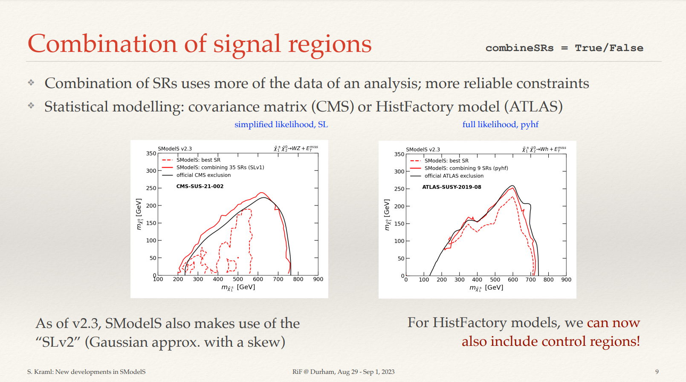
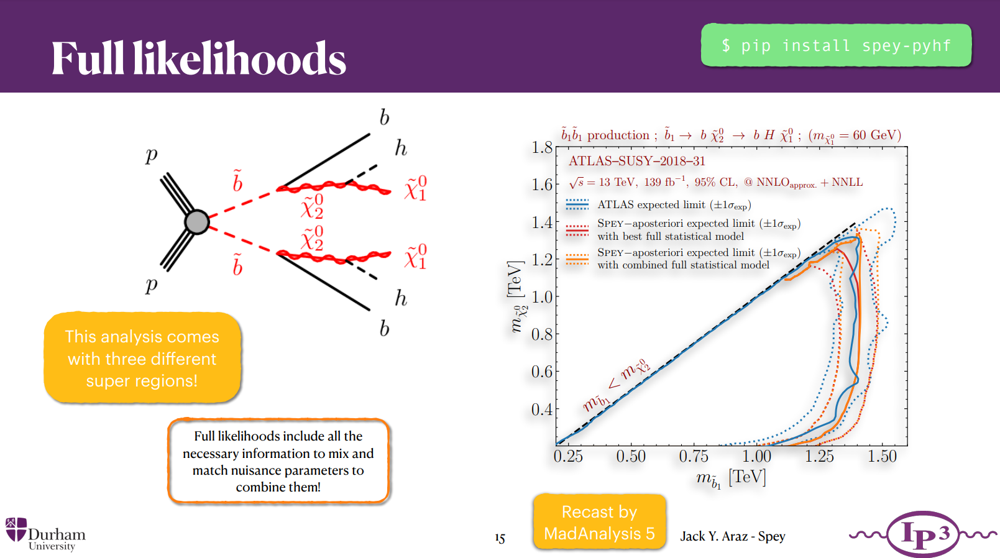
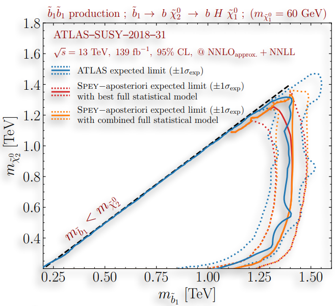
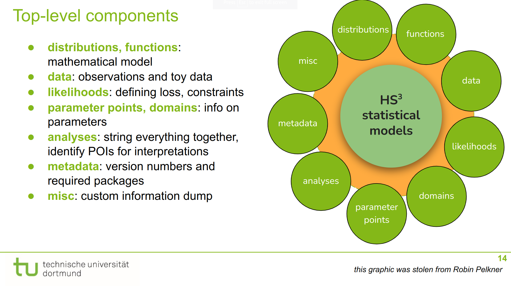
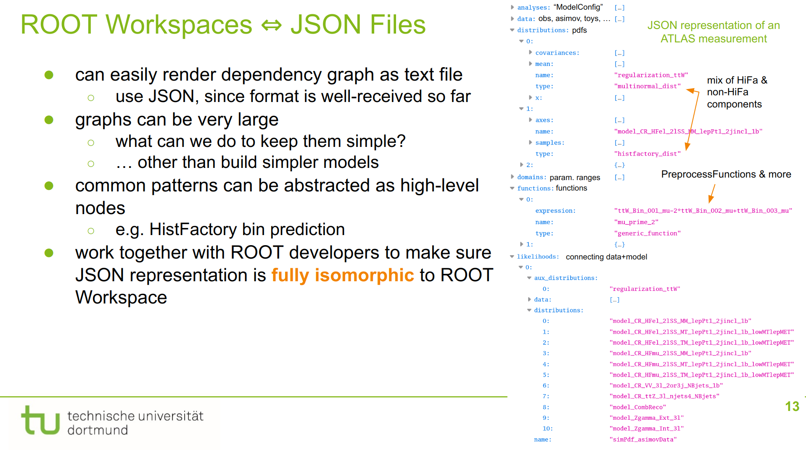
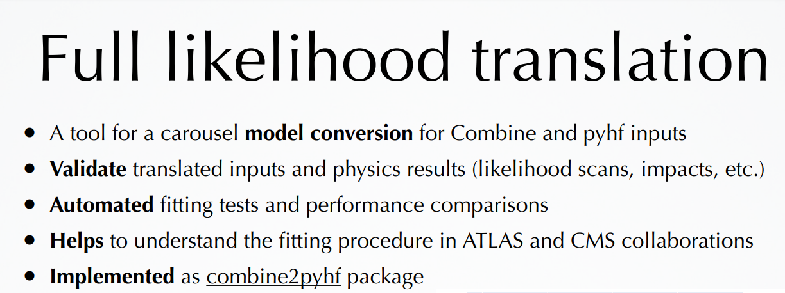
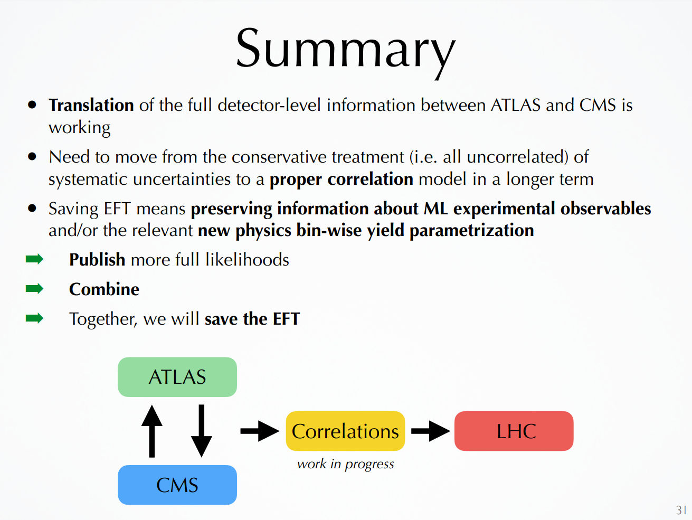

class: middle, center, title-slide
count: false

# LHC Reinterpretation Forum 2023 Summary
.large.blue[Matthew Feickert] 
.large[(University of Wisconsin-Madison)]
 
[matthew.feickert@cern.ch](mailto:matthew.feickert@cern.ch)
 

[ATLAS SUSY Workshop 2023](https://indico.cern.ch/event/1274064/timetable/#44-reinterpretation-forum-summ)

September 12th, 2023

---
# Talk notes

* ATLAS Summary of the 2023 (Re)interpretation of the LHC results for new physics
* Talk time: 20 minutes
   - talk: 15 minutes
   - questions: 5 minutes

---
# LHC Reinterpretation Forum 2023

.kol-1-2[
.large[
* Perspectives from the [8th workshop](https://conference.ippp.dur.ac.uk/event/1178/) of the [Forum on the interpretation of the LHC results for BSM studies](https://twiki.cern.ch/twiki/bin/view/LHCPhysics/InterpretingLHCresults)

* Much to summarize from an engaging week of discussions with ATLAS, CMS, Belle II, and theory, but focusing on
   - Accomplishments in publishing .bold[rich HEPData and full statistical models]
   - Work towards publishing and reusing .bold[machine learning workflows]
   - First meeting of the [LHC EFT Working Group](https://lpcc.web.cern.ch/lhc-eft-wg) with the Reinterpretation Forum
]
]
.kol-1-2[

   

.caption[[LHC Reinterpretation Forum 2023, IPPP Durham](https://conference.ippp.dur.ac.uk/event/1178/)]
]

---
# HEPData benefits: Full statistical models

.kol-1-2[
.huge[
* Rich HEPData archives seen to provide useful information for theory colleagues
   - Made very clear that the information that ATLAS is providing is useful and they want to be able to cite it
* Use of ATLAS full statistical models providing enhancement to theory recasting tools by allowing use of control regions during fits
]
]
.kol-1-2[

   

.caption[Signal region combination in CheckMATE]

   

.caption[New developments in SModelS]
]

---
# HEPData benefits: Full statistical models

.kol-1-2[
.huge[
* Multiple theory tools are now refactoring to interface with new `spey` likelihood building framework
* With full statistical models from ATLAS are able to properly handle nuisance parameters for improved combinations
]
]
.kol-1-2[

   

.caption[Spey: smooth inference for reinterpretation studies]
]

---
# HEPData benefits: Full statistical models

.kol-1-2[
.huge[
* Multiple theory tools are now refactoring to interface with new `spey` likelihood building framework
* With full statistical models from ATLAS are able to properly handle nuisance parameters for improved combinations
]
]
.kol-1-2[

   

.caption[Spey: smooth inference for reinterpretation studies]
]

---
# HEPData benefits: Full statistical models

.kol-1-2[
.large[
* The [HEP Statistics Serialization Standard (HS3)](https://github.com/hep-statistics-serialization-standard/hep-statistics-serialization-standard) allows for more publication through HEP universal serialization to JSON
   - Goal: Write (model) once, run anywhere
* Current draft version of HS3 available in the `master` branch of ROOT is being used to serialize a RooFit workspace for ongoing ATLAS analysis
   - `BAT.jl` implementation WIP
   - `pyhf` implementation planned following future development
]
]
.kol-1-2[

   

   

.caption[[HEP Statistics Serialization Standard](https://conference.ippp.dur.ac.uk/event/1178/contributions/6463/), Carsten Burgard]
]

---
# HEPData benefits: Full statistical models

.kol-1-2[
.huge[
* Growing interest in pursuing full statistical model benefits is evident from CMS studies towards combined ATLAS+CMS top EFT
* Tooling for bidirectional translation from HistFactory to CMS Combine model serialization with goals of simplifying ATLAS+CMS combinations
]
]
.kol-1-2[

   

   

.caption[[Save the EFT: a primer for the ATLAS+CMS combination in the top sector, Kirill Skovpen](https://conference.ippp.dur.ac.uk/event/1178/contributions/6434/)]
]

---
# Summary

.huge[
* Clear advantage that ATLAS has over CMS at the moment is publication of full statistical models and rich HEPData
   - Broader community loudly wants this and wants to provide citations
* Should be thinking about connections with LHC SMEFT community
* Reuse is important
]

---
class: end-slide, center

Backup

---
# Talks from ATLAS Collaborators

* [Reduce, Reuse, Reinterpret](https://conference.ippp.dur.ac.uk/event/1178/contributions/6442/), Giordon Stark
* [Active Learning for analysis reinterpretation and constraining additional physics parameters](https://conference.ippp.dur.ac.uk/event/1178/contributions/6449/), Christian Weber
* [Using unbinned measurements for new physics](https://conference.ippp.dur.ac.uk/event/1178/contributions/6431/), Ben Nachman
* [HEP Statistics Serialization Standard](https://conference.ippp.dur.ac.uk/event/1178/contributions/6463/), Carsten Burgard
* [Reusing Neural Networks: Lessons learned and Suggestions for the future](https://conference.ippp.dur.ac.uk/event/1178/contributions/6461/), Tomasz Procter
* [Parametrising profiled likelihoods with neural networks](https://conference.ippp.dur.ac.uk/event/1178/contributions/6435/), Humberto Reyes-González
* [Global Effective Field Theory fits from ATLAS](https://conference.ippp.dur.ac.uk/event/1178/contributions/6441/), Rahul Balasubramanian

---

class: end-slide, center
count: false

The end.
