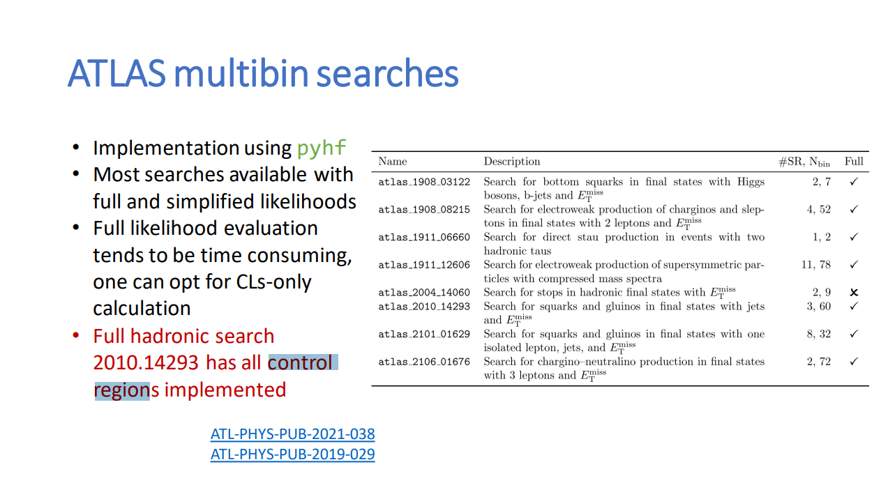
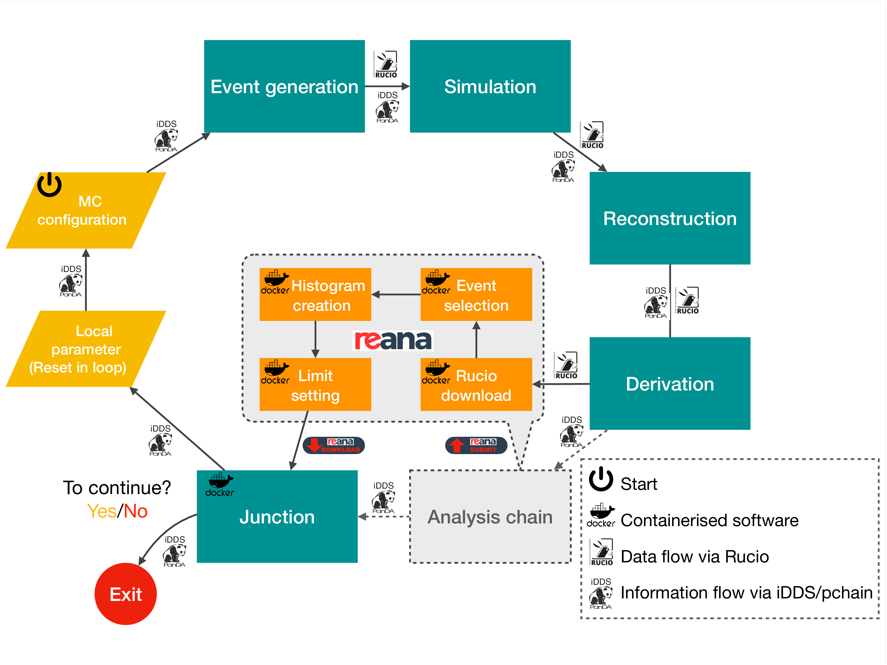

class: middle, center, title-slide
count: false

# LHC Reinterpretation Forum 2023 Summary
.large.blue[Matthew Feickert] 
.large[(University of Wisconsin-Madison)]
 
[matthew.feickert@cern.ch](mailto:matthew.feickert@cern.ch)
 

[ATLAS SUSY Workshop 2023](https://indico.cern.ch/event/1274064/contributions/5551300/)

September 12th, 2023

---
# LHC Reinterpretation Forum 2023

.kol-1-2[
.large[
* Perspectives from the [8th workshop](https://conference.ippp.dur.ac.uk/event/1178/) of the [Forum on the interpretation of the LHC results for BSM studies](https://twiki.cern.ch/twiki/bin/view/LHCPhysics/InterpretingLHCresults)
   - First meeting of the [LHC EFT Working Group](https://lpcc.web.cern.ch/lhc-eft-wg) with the Reinterpretation Forum
   - Multiple contributions from Belle II, working to follow reinterpretation best practices

* Much to summarize from an engaging week of discussions with ATLAS, CMS, Belle II, and theory, but focusing on
   - Accomplishments in publishing .bold[rich HEPData and full statistical models]
   - Work towards publishing and reusing .bold[machine learning workflows]
]
]
.kol-1-2[

   

.caption[[LHC Reinterpretation Forum 2023, IPPP Durham](https://conference.ippp.dur.ac.uk/event/1178/)]
]

---
# HEPData gains: Full statistical models

.kol-1-2[
.huge[
* Rich HEPData archives seen to provide useful information for theory colleagues
   - Made very clear that the information that ATLAS is providing is useful and they want to be able to cite it
* Use of ATLAS full statistical models providing enhancement to theory recasting tools by allowing use of control regions during fits and improved combinations
]
]
.kol-1-2[

   

.caption[[Signal region combination in CheckMATE](https://conference.ippp.dur.ac.uk/event/1178/contributions/6439/), Krzysztof Rolbiecki]

   

.caption[[New developments in SModelS](https://conference.ippp.dur.ac.uk/event/1178/contributions/6454/), Sabine Kraml]
]

---
# HEPData gains: Full statistical models

.kol-1-2[
.huge[
* Multiple theory tools are now refactoring to interface with new `spey` likelihood building framework
* With full statistical models from ATLAS are able to properly handle nuisance parameters for improved combinations
]
]
.kol-1-2[

   

.caption[[Spey: smooth inference for reinterpretation studies](https://conference.ippp.dur.ac.uk/event/1178/contributions/6436/), Jack Araz]
]

---
# HEPData gains: Full statistical models

.kol-1-2[
.huge[
* Multiple theory tools are now refactoring to interface with new `spey` likelihood building framework
* With full statistical models from ATLAS are able to properly handle nuisance parameters for improved combinations
]
]
.kol-1-2[

   

.caption[[Spey: smooth inference for reinterpretation studies](https://conference.ippp.dur.ac.uk/event/1178/contributions/6436/), Jack Araz]
]

---
# HEPData gains: Full statistical models

.kol-1-2[
.large[
* The [HEP Statistics Serialization Standard (HS3)](https://github.com/hep-statistics-serialization-standard/hep-statistics-serialization-standard) allows for more publication through HEP universal serialization to JSON
   - Goal: Write (model) once, run anywhere
* Current draft version of HS3 available in the `master` branch of ROOT is being used to serialize a RooFit workspace for ongoing ATLAS analysis
   - `BAT.jl` implementation WIP
   - `pyhf` implementation planned following future development
]
]
.kol-1-2[
 

   

.caption[[HEP Statistics Serialization Standard](https://conference.ippp.dur.ac.uk/event/1178/contributions/6463/), Carsten Burgard]
]

---
# HEPData gains: Full statistical models

.kol-1-2[
.large[
* The [HEP Statistics Serialization Standard (HS3)](https://github.com/hep-statistics-serialization-standard/hep-statistics-serialization-standard) allows for more publication through HEP universal serialization to JSON
   - Goal: Write (model) once, run anywhere
* Current draft version of HS3 available in the `master` branch of ROOT is being used to serialize a RooFit workspace for ongoing ATLAS analysis
   - `BAT.jl` implementation WIP
   - `pyhf` implementation planned following future development
]
]
.kol-1-2[
 

   

.caption[[HEP Statistics Serialization Standard](https://conference.ippp.dur.ac.uk/event/1178/contributions/6463/), Carsten Burgard]
]

---
# HEPData gains: Full statistical models

.kol-1-2[
.huge[
* Growing interest in pursuing full statistical model benefits is evident from CMS studies towards combined ATLAS+CMS top EFT
* Tooling for bidirectional translation from HistFactory to CMS Combine model serialization with goals of simplifying ATLAS+CMS combinations
]
]
.kol-1-2[

   

   

.caption[[Save the EFT: a primer for the ATLAS+CMS combination in the top sector](https://conference.ippp.dur.ac.uk/event/1178/contributions/6434/), Kirill Skovpen]
]

---
# ML + reinterpretation: DNN profiled likelihoods

.kol-1-3[
.large[
* While full statistical models allow for calculating the profiled likelihood during reinterpretation, the additional computation time might be traded for faster approximations for large surveys
* Learning a DNN representation of the profile likelihood allows for speedup while maintaining sufficient accuracy
]
]
.kol-2-3[

   

.caption[[Parametrising profiled likelihoods with neural networks](https://conference.ippp.dur.ac.uk/event/1178/contributions/6435/), Humberto Reyes-González]

.large[
* NN model serialzed to ONNX distributed to Zenodo
]
]

---
# ML + reinterpretation: Active learning

.kol-1-2[
.huge[
* Linear grid search in for limit setting in parameter space is computationally intensive
* Instead can learn the exclusion contour with active learning reducing total computing time
   - Requires intensive ML workflow though
]
]
.kol-1-2[
 

   

.caption[[Active Learning](https://conference.ippp.dur.ac.uk/event/1178/contributions/6449/), Christian Weber]
]

---
# ML + reinterpretation: Active learning

.kol-1-2[
.large[
* [ATL-PHYS-PUB-2023-010](https://atlas.web.cern.ch/Atlas/GROUPS/PHYSICS/PUBNOTES/ATL-PHYS-PUB-2023-010/) leverages REANA to run the workflows at scale with analysis loop until contour learned
]

   

.caption[[ATL-PHYS-PUB-2023-010](https://atlas.web.cern.ch/Atlas/GROUPS/PHYSICS/PUBNOTES/ATL-PHYS-PUB-2023-010/)]
]
.kol-1-2[
 

   

.caption[[Active Learning](https://conference.ippp.dur.ac.uk/event/1178/contributions/6449/), Christian Weber]
]

---
# ML + reinterpretation: Publication of data products

.kol-1-2[
.large[
* The "Les Houches guide to reusable ML models in LHC analyses" guidelines (forthcoming) advocates
   - As ML becomes increasingly a core part of analysis workflow also important to preserve the workflows
   - Use of open source machine learning framework
   - Serialize ML model in preservation format for inference (e.g. [ONNX](https://onnx.ai/), [lwtnn](https://github.com/lwtnn/lwtnn))
]
]
.kol-1-2[
.large[
* ATLAS SUSY has made two ML models public through archival on HEPData via ONNX, though publication of `lwtnn` files to HEPData has yet to happen
   <!-- - [ATLAS-SUSY-2019-04](https://www.hepdata.net/record/resource/2677521?landing_page=true) -->
]

   

.caption[[Recastable ML](https://conference.ippp.dur.ac.uk/event/1178/contributions/6461/), Tomasz Procter]
]

---
# ML + reinterpretation: Publication of data products

.kol-1-2[
.large[
* Supplementary Material
   - Improved definitions and documentation of all input and output variables for ML model
   - Leverage .bold[validated] analysis code implementation (e.g.`rivet` or `SimpleAnlaysis`)
   - At minimum, would want a short note that could be uploaded alongside ML model serialization
* ATLAS `SimpleAnalysis` and RECAST already puts these within easy reach
]
]
.kol-1-2[
.large[
* Validation Material
   - Cutflows: When cuts depend on a neural net output
   - Along with cutflows need to know exact signal models (provide SHLA files, simulation run cards)
   - Input and output plots (especially for important features)
]
]

---
# Summary

.huge[
* Clear advantage that ATLAS has over CMS at the moment is publication of full statistical models and rich HEPData
   - Broader community loudly wants to use it and wants to cite it when used
   - Theory community explicitly requests full statistical models continue to be published
* ML continues to bring new approaches to reinterpretation and community recommendations
   - Les Houches guide to reusable ML models in LHC analyses guidelines
   - Across theory and experiment advantages being seen in terms of compute saving
]

---
class: end-slide, center

Backup

---
# Talks from ATLAS Collaborators

* [Testing the scalar triplet solution to CDF's heavy $W$ problem at the LHC](https://conference.ippp.dur.ac.uk/event/1178/contributions/6447/), Jon Butterworth
* [Reduce, Reuse, Reinterpret](https://conference.ippp.dur.ac.uk/event/1178/contributions/6442/), Giordon Stark
* [Active Learning for analysis reinterpretation and constraining additional physics parameters](https://conference.ippp.dur.ac.uk/event/1178/contributions/6449/), Christian Weber
* [Using unbinned measurements for new physics](https://conference.ippp.dur.ac.uk/event/1178/contributions/6431/), Ben Nachman
* [HEP Statistics Serialization Standard](https://conference.ippp.dur.ac.uk/event/1178/contributions/6463/), Carsten Burgard
* [Reusing Neural Networks: Lessons learned and Suggestions for the future](https://conference.ippp.dur.ac.uk/event/1178/contributions/6461/), Tomasz Procter
* [Global Effective Field Theory fits from ATLAS](https://conference.ippp.dur.ac.uk/event/1178/contributions/6441/), Rahul Balasubramanian

---
# Reinterpretation for unbinned measurements

.kol-1-2[
.large[
* Inference-aware binning
   - Publish measurement, then for reinterpretation select optimal binning for analysis
* Derivative Measurements
   - Allows later for $f(x)$ when $x$ measured
* Extension to higher-dimensions
   - ML tools extend readily to multiple dimensions
]
]
.kol-1-2[

   

.caption[[Using unbinned measurements for new physics](https://conference.ippp.dur.ac.uk/event/1178/contributions/6431/), Ben Nachman]
]

---

class: end-slide, center
count: false

The end.
